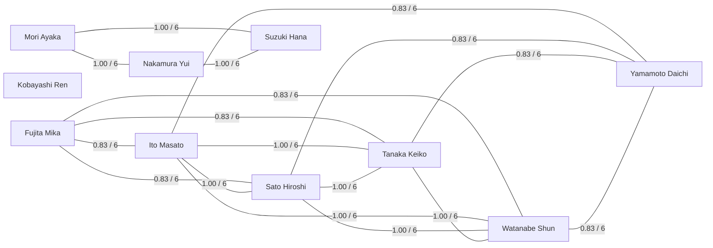

# Computed Faction Report

Factions are calculated from voting similarity, not entered by hand.
An edge means two members agreed on at least 72% of common recorded votes with at least three common votes.

## Factions

- Faction 1: Fujita Mika, Ito Masato, Sato Hiroshi, Tanaka Keiko, Watanabe Shun, Yamamoto Daichi
- Faction 2: Mori Ayaka, Nakamura Yui, Suzuki Hana
- Faction 3: Kobayashi Ren

## Member Faction Signals

- Sato Hiroshi: faction_1, cohesion=0.93
- Tanaka Keiko: faction_1, cohesion=0.93
- Yamamoto Daichi: faction_1, cohesion=0.80
- Mori Ayaka: faction_2, cohesion=1.00
- Kobayashi Ren: faction_3, cohesion=0.00
- Nakamura Yui: faction_2, cohesion=1.00
- Ito Masato: faction_1, cohesion=0.93
- Suzuki Hana: faction_2, cohesion=1.00
- Watanabe Shun: faction_1, cohesion=0.93
- Fujita Mika: faction_1, cohesion=0.80

## Strong Pairwise Similarities

- Ito Masato - Sato Hiroshi: 1.00 over 6 common votes
- Ito Masato - Tanaka Keiko: 1.00 over 6 common votes
- Ito Masato - Watanabe Shun: 1.00 over 6 common votes
- Mori Ayaka - Nakamura Yui: 1.00 over 6 common votes
- Mori Ayaka - Suzuki Hana: 1.00 over 6 common votes
- Nakamura Yui - Suzuki Hana: 1.00 over 6 common votes
- Sato Hiroshi - Tanaka Keiko: 1.00 over 6 common votes
- Sato Hiroshi - Watanabe Shun: 1.00 over 6 common votes
- Tanaka Keiko - Watanabe Shun: 1.00 over 6 common votes
- Fujita Mika - Ito Masato: 0.83 over 6 common votes
- Fujita Mika - Sato Hiroshi: 0.83 over 6 common votes
- Fujita Mika - Tanaka Keiko: 0.83 over 6 common votes
- Fujita Mika - Watanabe Shun: 0.83 over 6 common votes
- Ito Masato - Yamamoto Daichi: 0.83 over 6 common votes
- Sato Hiroshi - Yamamoto Daichi: 0.83 over 6 common votes
- Tanaka Keiko - Yamamoto Daichi: 0.83 over 6 common votes
- Watanabe Shun - Yamamoto Daichi: 0.83 over 6 common votes

## Mermaid Faction Plot

